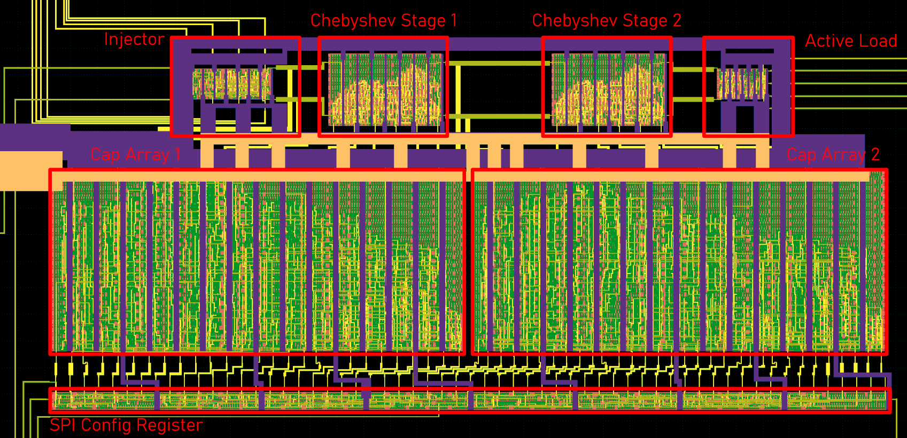

# Project-Futo

Playing with Nauta Transconductors

Is it possible to implement an analog BPF using only digital cells?

")

Yinyang

## Test Chip 1: GFMPW0

The filter is fabricated in GFMPW0

### Pinout

|AD2 | Port | Dir | Name      | Function                |
|----|------|-----|-----------|-------------------------|
|    | 29   | Out | outp      |                         |
|    | 30   | Out | outn      |                         |
|    | 31   | Out | outpn     |                         |
|    | 32   | Out | outnn     |                         |
|    | 33   | Out | outxor    |                         |
| D0 | 28   | Out | sr_out    | Shift Reg Output        |
| D1 | 27   | In  | sclk      | Shift Reg Clock         |
| D2 | 26   | In  | sdin      | Shift Reg Data In       |
| D3 | 25   | In  | latch     | Shift Reg Latch Output  |
| D4 | 24   | In  | enable    | Filter Injector Enable  |
| D5 | 23   | In  | signal    | Filter Signal Input     | 
|    | 22   | In  | trim_n[3] | Filter Injector Trimmer |
|    | 21   | In  | trim_n[2] |                         |
|    | 20   | In  | trim_n[1] |                         |
|    | 19   | In  | trim_n[0] |                         | 
|    | 18   | In  | trim_p[0] |                         |
|    | 17   | In  | trim_p[1] |                         |
|    | 16   | In  | trim_p[2] |                         | 
|    | 15   | In  | trim_p[3] |                         | 
|    |      | Pwr | vccd1     | 1.8V Supply             |
|    |      | Pwr | vddio     | 3.3V IO Supply          |

The testboard is here:
[https://github.com/efabless/caravel_board](https://github.com/efabless/caravel_board)
@ Commit `8b965cd39c64f28c24af80159d6b48bc4cc00404`
